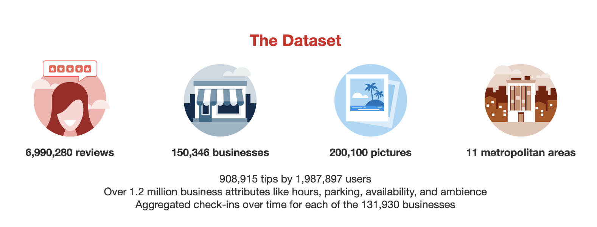

# Proyecto: Análisis de Negocios y Reseñas

## Descripción del Proyecto

Este proyecto tiene como objetivo analizar los datos de negocios y sus reseñas para descubrir patrones y generar insights valiosos para la toma de decisiones de los propietarios de negocios. Utilizando un conjunto de datos de negocios y reseñas, se realizarán varias preguntas de investigación para explorar las interacciones entre los clientes y los negocios, así como las características que influyen en las calificaciones y la cantidad de reseñas.

## Dataset

### Datos de Negocios

El primer dataset contiene información detallada sobre los negocios. Este dataset tiene un total de **150,346 registros** y **14 columnas**. Las variables clave de este dataset son:

- **business_id** (string): Identificador único del negocio.
- **name** (string): Nombre del negocio.
- **address** (string): Dirección del negocio.
- **city** (string): Ciudad donde está ubicado el negocio.
- **state** (string): Estado del negocio.
- **postal_code** (string): Código postal del negocio.
- **latitude** (float): Latitud de la ubicación geográfica del negocio.
- **longitude** (float): Longitud de la ubicación geográfica del negocio.
- **stars** (float): Calificación promedio del negocio basada en las reseñas (valor entre 1 y 5).
- **review_count** (int): Número total de reseñas que ha recibido el negocio.
- **is_open** (int): Indica si el negocio está abierto (1) o cerrado (0).
- **attributes** (object): Atributos adicionales del negocio (comida para llevar, estacionamiento, etc.).
- **categories** (object): Categorías a las que pertenece el negocio (por ejemplo, restaurantes, bares, etc.).
- **hours** (object): Horarios de apertura y cierre de los negocios por día de la semana.

### Datos de Reseñas

El segundo dataset contiene información sobre las reseñas de los usuarios. Este dataset cuenta con **500,000 registros** y **9 columnas**. Las variables clave de este dataset son:

- **review_id** (string): Identificador único de la reseña.
- **user_id** (string): Identificador único del usuario que escribió la reseña.
- **business_id** (string): Identificador único del negocio al que corresponde la reseña (relacionado con el dataset de negocios).
- **stars** (int): Calificación otorgada en la reseña (valor entre 1 y 5).
- **useful** (int): Número de votos indicando cuán útil fue la reseña.
- **funny** (int): Número de votos indicando cuán divertida fue la reseña.
- **cool** (int): Número de votos indicando cuán "cool" fue la reseña.
- **text** (string): Texto completo de la reseña.
- **date** (string): Fecha en la que se escribió la reseña.

## Exploración y Análisis de Datos

## Preguntas de Investigación Iniciales

1. **¿Los negocios que cuentan con servicios adicionales como WiFi, Tv,  estacionamiento, entre otros, tienden a recibir mejores calificaciones de los clientes?**

2. **¿Cómo varían las calificaciones y la cantidad de reseñas dependiendo de la ubicación geográfica del negocio?**

3. **¿Los negocios con más años de operación tienden a tener calificaciones más estables o superiores en comparación con los negocios más nuevos?**

4. **¿Qué categorías de negocios tienen un mayor porcentaje de locales cerrados y cómo ha sido el comportamiento de las calificaciones de estas categorías en los últimos años?**

5. **¿Qué factores contribuyen a que una reseña sea considerada "útil" por otros usuarios?**

### Metodología de Análisis

1. **Limpieza y preparación de los datos:**
   - Se eliminarán valores faltantes y se imputarán donde sea necesario.
   - Se transformarán los atributos booleanos en formato adecuado para el análisis.

2. **Análisis de correlaciones:**
   - Se utilizarán métodos de correlación para investigar la relación entre las calificaciones, las reseñas y los atributos del negocio.

3. **Visualización de los datos:**
   - Se crearán gráficos para representar la relación entre las calificaciones, el número de reseñas y los diferentes atributos del negocio, incluyendo facilidades como WiFi, HappyHour y la presencia de estacionamiento.

4. **Feature Scaling:**
   - Se aplicará estandarización o normalización a las variables numéricas (`review_count`, `stars`, `useful`, etc.) para mejorar el rendimiento de los modelos predictivos.

5. **Modelado predictivo:**
   - Se implementará un modelo de clasificación, utilizando métodos de filtro como la ganancia de información, para predecir si una reseña será útil o "cool" basándose en las características del negocio y las reseñas.

## Resultados Esperados

- **Accesibilidad y calificaciones:** Se espera que los negocios con facilidades como acceso para sillas de ruedas y aceptación de tarjetas de crédito reciban mejores calificaciones.
- **Ubicación y reseñas:** Los negocios en grandes ciudades o áreas turísticas tienden a recibir más reseñas y calificaciones más altas.
- **Años de operación y estabilidad:** Los negocios con más años de operación podrían tener calificaciones más estables y recibir más reseñas.
- **Servicios personalizados y satisfacción:** Negocios que ofrecen servicios personalizados, como reservas y ser pet-friendly, tienden a recibir mejores calificaciones.

Este análisis proporcionará insights clave para los propietarios de negocios, ayudándolos a mejorar sus operaciones y optimizar la satisfacción del cliente.
